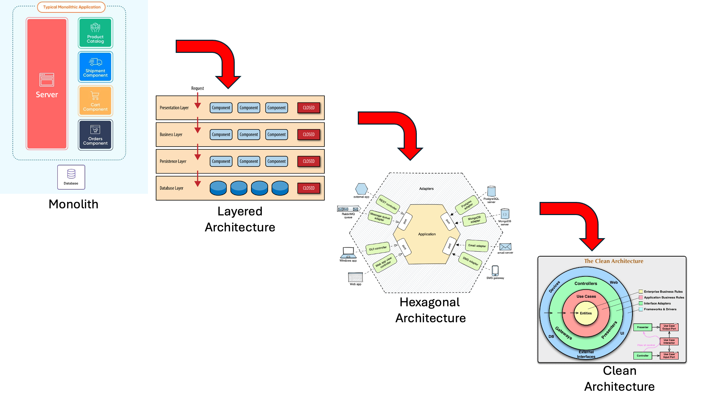
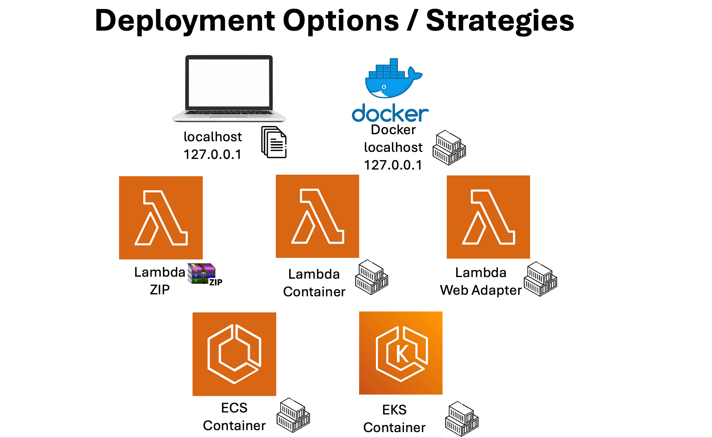
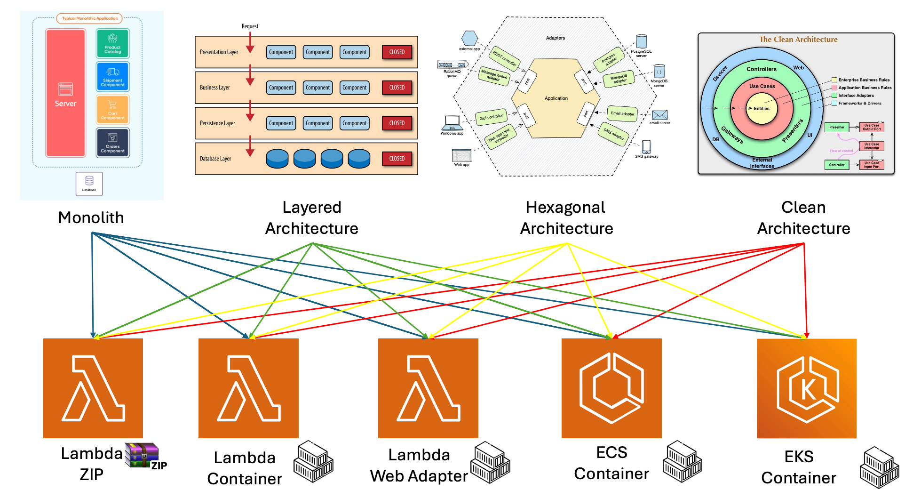

# Software Architectural Evolution And Portable Application Deployment on AWS

This project is your practical guide to mastering modern software architecture patterns. Through a hands-on journey of evolving a simple user management application, you'll learn how to transform a basic monolithic codebase into a sophisticated clean architecture implementation. But that's not all – you'll also discover how to maintain deployment flexibility across various AWS compute services, a critical skill in today's cloud-native world.

Whether you're a developer wanting to understand architectural patterns, a tech lead making architectural decisions, or an architect looking for practical examples, this project offers valuable insights into:
- The natural evolution of software architecture
- Real-world implementation of popular architectural patterns
- Practical trade-offs between different architectural approaches
- Cloud-native deployment strategies
- Modern development best practices

<div align="center">
    
    <br>
    <i>Software Architectural Evolution Journey</i>
</div>


This project demonstrates various deployment options on AWS compute services, including [AWS Lambda](https://aws.amazon.com/lambda/), [Amazon ECS](https://aws.amazon.com/ecs/), and [Amazon EKS](https://aws.amazon.com/eks/). By implementing best architecture principles, the application remains portable and deployment-agnostic, mitigating vendor or even service lock-in concerns. You'll discover how well-architected software can be efficiently deployed across different technologies and AWS services while maintaining its core functionality and structure.

<div align="center">
    
    <br>
</div>

AWS provides a comprehensive suite of services and technologies that act as building blocks, empowering customers to architect solutions that best fit their specific needs. Rather than enforcing a one-size-fits-all approach, AWS offers flexibility through modular components that can be mixed and matched. This allows organizations to select and combine services based on their unique requirements, whether it's compute ([EC2](https://aws.amazon.com/ec2/), [Lambda](https://aws.amazon.com/lambda/), [ECS](https://aws.amazon.com/ecs/), [EKS](https://aws.amazon.com/eks/)), storage ([S3](https://aws.amazon.com/s3/), [EBS](https://aws.amazon.com/ebs/), [EFS](https://aws.amazon.com/efs/)), databases ([RDS](https://aws.amazon.com/rds/), [DynamoDB](https://aws.amazon.com/dynamodb/), [Aurora](https://aws.amazon.com/rds/aurora/)), or any other cloud capability. This building block approach ensures customers maintain control over their architecture while leveraging AWS's robust infrastructure and services.


<div align="center">
    
    <br>
    <i>Deployment Evolution Path</i>
</div>

## Project Overview

The project demonstrates the progressive evolution of software architecture through four key stages, each building upon the lessons and limitations of the previous:

**Monolithic Architecture**
   - Single, unified codebase where all components are tightly integrated
   - Direct dependencies between business logic, data access, and presentation
   - Simple to understand and quick to develop initially
   - Becomes challenging to maintain and modify as application grows

**Layered Architecture**
   - First step towards better organization through separation into distinct layers
   - Clear hierarchical structure: Presentation → Business → Data layers
   - Each layer has specific responsibilities and concerns
   - Improved maintainability through reduced coupling between components
   - Still maintains some dependencies between layers

**Hexagonal Architecture**
   - Introduces ports and adapters to isolate core business logic
   - Domain logic becomes independent of external concerns
   - Better adaptability to changing requirements
   - Easier to swap implementations (e.g., switching databases)
   - Enhanced testability through clear boundaries

**Clean Architecture**
   - Culmination of architectural evolution with complete separation of concerns
   - Domain entities at the core, surrounded by use cases
   - Independent of frameworks, UI, and databases
   - Maximum flexibility for changes and testing
   - Dependency rule ensures stability: dependencies point inward
   - Clear separation between business rules and implementation details

The software architecture evolves through increasing sophistication and separation of concerns, following this progression:

```
Monolithic → Layered → Hexagonal → Clean Architecture
```

This sequence demonstrates how the architecture matures to achieve:
- Better separation of concerns
- Increased modularity and flexibility
- Improved testability and maintainability
- Enhanced deployment options

## Final Implementation Matrix

By completing this project, you'll gain the ability to implement and deploy any combination of architectural pattern and AWS compute service. This creates a powerful matrix of possibilities:

<div align="center">
    
    <br>
    <i>Matrix of Possible Implementations</i>
</div>

This implementation matrix demonstrates the true power of well-architected applications. Each architectural style (Monolithic, Layered, Hexagonal, and Clean) can be successfully deployed to any of the target compute services (Lambda ZIP, Lambda Container, Lambda Web Adapter, ECS, and EKS). This flexibility is achieved through:

1. **Architecture Independence**
   - Each architectural pattern maintains its core functionality regardless of deployment platform
   - Business logic remains consistent across all deployment options
   - Different architectural approaches can coexist in the same organization

2. **Deployment Flexibility**
   - Start with simpler deployments and evolve as needed
   - Mix and match architectures and deployment platforms based on specific requirements
   - Migrate between compute services without rewriting application logic

3. **Learning Opportunities**
   - Understand the trade-offs between different architectural patterns in real-world scenarios
   - Experience how each architecture behaves in different deployment environments
   - Gain practical insights into cloud-native application development

This comprehensive approach ensures you're well-equipped to make informed decisions about both architecture and deployment strategies in your own projects.

## Security

See [CONTRIBUTING](CONTRIBUTING.md#security-issue-notifications) for more information.

## License

This library is licensed under the MIT-0 License. See the LICENSE file.
